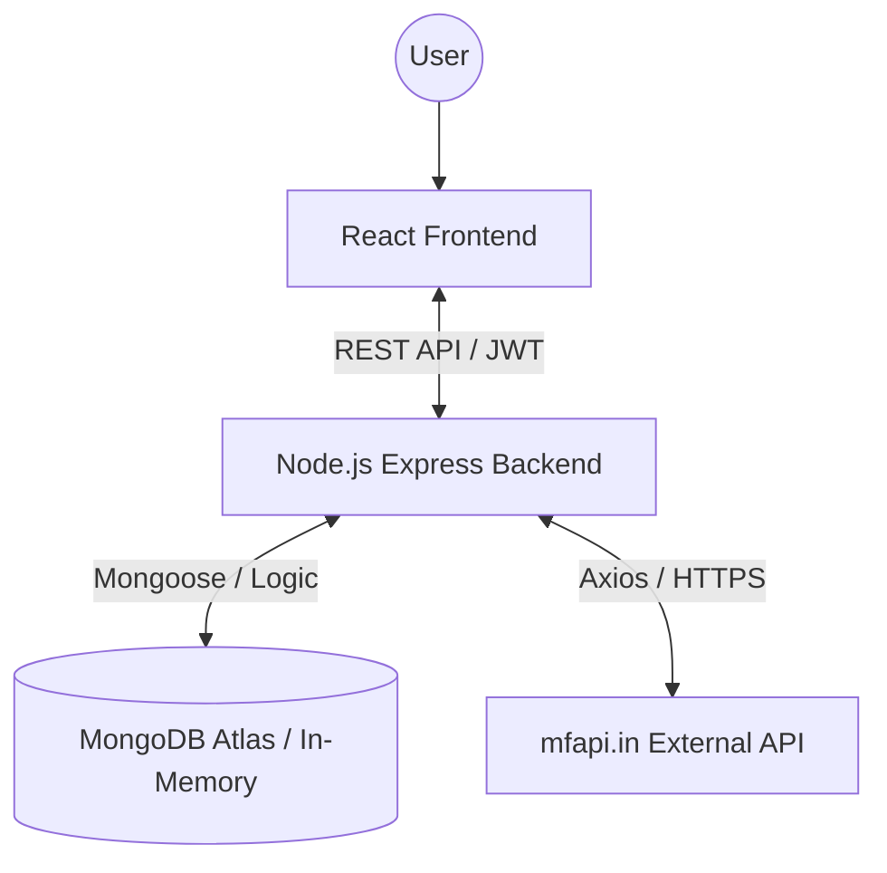
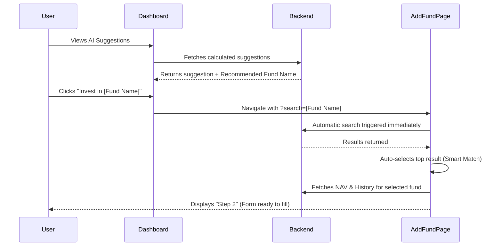

# 🚀 FundIQ: Project Workflow & Technical Deep-Dive

This document provides a comprehensive overview of how **FundIQ** operates, from the user clicking a button to the backend interacting with the database and external APIs.

---

## 🏗️ 1. High-Level Architecture

FundIQ follows a modern MERN-like stack (using Node/Express for the backend) with a focus on high-performance data caching and real-time mutual fund tracking.

---

## 🔐 2. Authentication Workflow
**When a user logs in or registers.**

1.  **Frontend**: User enters credentials in `AuthPage.jsx`.
2.  **State Management**: `AuthContext.jsx` sends a POST request to `/api/auth/login`.
3.  **Backend**: 
    *   Checks if the user exists in **MongoDB** or **MemDB**.
    *   Verifies password using `bcrypt`.
    *   Generates a **JWT Token** containing the user ID.
4.  **Response**: Frontend receives the token and stores it. All subsequent requests include this token in the `Authorization` header.

---

## 📈 3. Portfolio Loading Workflow
**When the user opens the Dashboard.**

1.  **Frontend**: `PortfolioContext.jsx` triggers a `fetchPortfolio()` call on mount.
2.  **API**: `GET /api/portfolio`
3.  **Backend Logic**:
    *   **Retrieval**: Fetches all holdings for the logged-in user.
    *   **NAV Sync**: Checks the `navCache`. If data is older than 24h, it calls `mfapi.in` to get fresh NAVs for every holding in parallel.
    *   **Calculation**: Computes total investment, current value, absolute gain, and **XIRR/CAGR**.
    *   **AI Analysis**: Runs the `generateSuggestions` function to check for diversification issues or growth opportunities.
4.  **Frontend**: The Dashboard displays the charts (Asset Allocation) and the Recent Holdings table.

---

## ➕ 4. "Add Fund" & Automatic Filling Workflow
**This is the core feature for expanding the portfolio.**

### Step-by-Step Flow:
1.  **Search Input**: User types in `AddFund.jsx`. 
    *   *Frontend*: Debounces input for 400ms.
    *   *Backend*: Proxies the request to `https://api.mfapi.in/mf/search`.
2.  **Selection**: User clicks a fund result.
3.  **Data Fetching**: 
    *   The backend calls `GET /api/portfolio/nav-history/:code`.
    *   It fetches the **entire historical NAV record** from the external API.
    *   It stores this in `nav-cache.json` so future lookups are instant.
4.  **Dynamic Calculation**: 
    *   As the user changes the "Purchase Date", the frontend instantly finds the NAV for that specific day from the cached history.
    *   It auto-calculates the Units allotted.
5.  **Submission**: Holding is saved to the database.

---

## 🤖 5. AI Suggestions & Deep Linking
**How the "Invest" buttons work.**

1.  **The Trigger**: Click a blue fund link or "Invest" button in an AI suggestion.
2.  **The Routing**: URL changes to `/add-fund?search=UTI%20Nifty%2050...`.
3.  **The Logic (`AddFund.jsx`)**: 
    *   `useEffect` detects the `search` param.
    *   `handleSearch(query, true)` is fired instantly.
    *   If a result matches the name (ignoring case/spaces), `selectFund(first)` is called automatically.
4.  **The Result**: The user sees a sequence of success toasts and lands directly on the investment form, saving 3-4 manual clicks.

---

## 📂 6. Data Storage Workflow
*   **MongoDB Atlas**: Default persistent storage. Used for User profiles and Portfolio holdings.
*   **navCache (In-Memory + JSON)**: High-speed cache for NAV data. It syncs to `backend/nav-cache.json` every few hours so that restarts don't lose performance.
*   **MemDB Fallback**: If the server can't reach MongoDB, it shifts to a "Trial Mode" using an internal JS object. Data is lost on server restart, but the app stays functional.

---

## 🛠️ 7. Frontend Architecture
*   **Context API**: `AuthContext` and `PortfolioContext` handle global state (no Redux needed).
*   **UI System**: Vanilla CSS with "Glassmorphism" effects defined in `index.css`. 
*   **Charts**: `react-chartjs-2` used for the Donut and Portfolio Performance charts.
